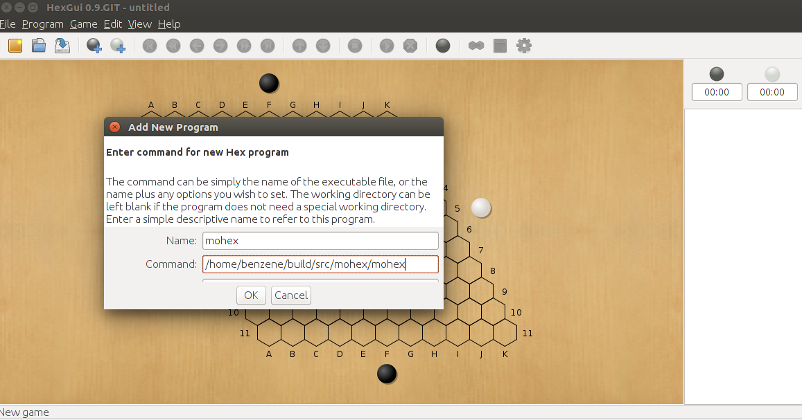
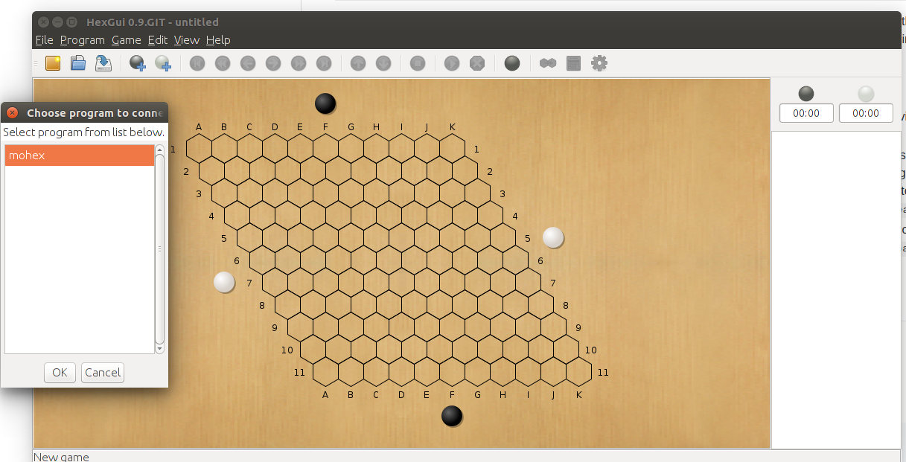

# benzene-vanilla-cmake (MoHex 2.0 and Wolve)

A CMake managed benzene repository for playing and solving Hex.
See http://benzene.sourceforge.net/ for description of the benzene project up to 2011. 
Note that the 2011 version has a rather weak MCTS engine if not given many lock-free threads; see the 2011 Computer Olympiad Hex tournament report for details.  

This repository contains later development of benzene until 2015, including:

Pawlewicz, Jakub, et al. [Stronger Virtual Connections in Hex.](https://webdocs.cs.ualberta.ca/~hayward/papers/strongervcs.pdf)

Huang, Aja, et al. [MoHex 2.0: A Pattern-Based MCTS Hex Player](https://pdfs.semanticscholar.org/c88a/df13845554bd5b27c351d723fc76fb717786.pdf)

Pawlewicz, Jakub, et al. [Scalable Parallel DFPN Search](https://webdocs.cs.ualberta.ca/~hayward/papers/pawlhayw.pdf)

## Getting Started
Benzene is written in C++. To start, you need recent C++ compiler such as g++ 4.8 or later on version installed. Clone the repository to your local machine, you need to use CMake to compile the project, two executables, wolve and mohex, will be produced after successful compilation.  
Run wolve or mohex, this will lead to a command line interactive environment where you can type commands to let the player produce results typically after certain amount of search, or configure the player on-the-fly by indicating specific parameters.

### Prerequisites

To compile this project, you need the following tools

```
A modern C++ compiler, such as g++ 4.8 or above
```

```
CMakve version 3.5 or above
```

Dependent libraries: 
```
Boost, version 1.54 or higher
on Ubuntu, install boost via sudo apt-get install libboost-all-dev
```

```
Berkeley-DB.
On Ubuntu, one can install Berkeley-DB by sudo apt-get install libdb-dev
```
Note that you do not have to install `fuego` separately for benzene since I have incorporated those libraries to this repository. They will be compiled with other code in benzene altogether.   
### Building

```
git clone project_url
cd benzene-vanilla-cmake
mkdir build
cd build
cmake ../
make -j4
```

If no errors occurred, run mohex by

```
./build/src/mohex/mohex 
```
which displays the default settings before going to the interactive terminal like:
```
MoHex 2.0.CMake Apr 12 2018
Copyright (C) 2007-2012 by the authors of the Benzene project.
This program comes with ABSOLUTELY NO WARRANTY. This is
free software and you are welcome to redistribute it under
certain conditions. Type `benzene-license' for details.

SgRandom::SetSeed: 1523557498
SgUctSearch: system memory 8282574848, using 1000000000 (5681818 nodes)
SgRandom::SetSeed: 1
SgRandom::SetSeed: 1523557498
f95d7 info: Prior Patterns:
f95d7 info: Global:
f95d7 info: Size            = 565 32648 
f95d7 info: TableEntries    = 65932 65910
f95d7 info: MirrorsAdded    = 0 0
f95d7 info: PrunableCount   = 30593 30629
f95d7 info: LargestGamma    = 5820.77
f95d7 info: SmallestGamma   = 6.6e-05
f95d7 info: Local:
f95d7 info: Size            = 550 5318 
f95d7 info: TableEntries    = 11602 11588
f95d7 info: MirrorsAdded    = 0 0
f95d7 info: PrunableCount   = 3659 3667
f95d7 info: LargestGamma    = 11281.8
f95d7 info: SmallestGamma   = 0.026235
f95d7 info: Playout Patterns:
f95d7 info: Global:
f95d7 info: Size            = 565 32648 
f95d7 info: TableEntries    = 70329 70329
f95d7 info: MirrorsAdded    = 4397 4419
f95d7 info: PrunableCount   = 30593 30629
f95d7 info: LargestGamma    = 5820.77
f95d7 info: SmallestGamma   = 6.6e-05
f95d7 info: Local:
f95d7 info: Size            = 550 5318 
f95d7 info: TableEntries    = 11602 11588
f95d7 info: MirrorsAdded    = 0 0
f95d7 info: PrunableCount   = 3659 3667
f95d7 info: LargestGamma    = 11281.8
f95d7 info: SmallestGamma   = 0.026235

```
or wolve

```
./build/src/wolve/wolve
```
which produces: 
```
Wolve 2.0.CMake Apr 12 2018
Copyright (C) 2007-2012 by the authors of the Benzene project.
This program comes with ABSOLUTELY NO WARRANTY. This is
free software and you are welcome to redistribute it under
certain conditions. Type `benzene-license' for details.

SgRandom::SetSeed: 1523557601

```
## Running some tests

Some typical commands may be used to see if the executables work well  

```
showboard
= 
 
  ab8d165ede7c8d69
  a  b  c  d  e  f  g  h  i  j  k  l  m  
 1\.  .  .  .  .  .  .  .  .  .  .  .  .\1
  2\.  .  .  .  .  .  .  .  .  .  .  .  .\2
   3\.  .  .  .  .  .  .  .  .  .  .  .  .\3
    4\.  .  .  .  .  .  .  .  .  .  .  .  .\4
     5\.  .  .  .  .  .  .  .  .  .  .  .  .\5
      6\.  .  .  .  .  .  .  .  .  .  .  .  .\6
       7\.  .  .  .  .  .  .  .  .  .  .  .  .\7
        8\.  .  .  .  .  .  .  .  .  .  .  .  .\8
         9\.  .  .  .  .  .  .  .  .  .  .  .  .\9
         10\.  .  .  .  .  .  .  .  .  .  .  .  .\10
          11\.  .  .  .  .  .  .  .  .  .  .  .  .\11
           12\.  .  .  .  .  .  .  .  .  .  .  .  .\12
            13\.  .  .  .  .  .  .  .  .  .  .  .  .\13
                a  b  c  d  e  f  g  h  i  j  k  l  m  

genmove b
25c07 info: Best move cannot be determined, must search state.
25c07 info: --- MoHexPlayer::Search() ---
25c07 info: Color: black
25c07 info: MaxGames: 99999999
25c07 info: NumberThreads: 1
25c07 info: MaxNodes: 11363636 (999999968 bytes)
25c07 info: TimeForMove: 10
25c07 info: Time for PreSearch: 0.672639s
25c07 info: 
  ab8d165ede7c8d69
  a  b  c  d  e  f  g  h  i  j  k  l  m  
 1\.  .  .  .  .  .  .  .  .  .  .  .  .\1
  2\.  .  *  *  *  *  *  *  *  *  *  *  *\2
   3\.  *  *  *  *  *  *  *  *  *  *  *  *\3
    4\*  *  *  *  *  *  *  *  *  *  *  *  *\4
     5\*  *  *  *  *  *  *  *  *  *  *  *  *\5
      6\*  *  *  *  *  *  *  *  *  *  *  *  *\6
       7\*  *  *  *  *  *  *  .  .  .  .  .  .\7
        8\.  .  .  .  .  .  .  .  .  .  .  .  .\8
         9\.  .  .  .  .  .  .  .  .  .  .  .  .\9
         10\.  .  .  .  .  .  .  .  .  .  .  .  .\10
          11\.  .  .  .  .  .  .  .  .  .  .  .  .\11
           12\.  .  .  .  .  .  .  .  .  .  .  .  .\12
            13\.  .  .  .  .  .  .  .  .  .  .  .  .\13
                a  b  c  d  e  f  g  h  i  j  k  l  m  
25c07 info: No subtree to reuse.
25c07 info: Creating thread 0
25c07 info: StartSearch()[0]
 0:05 | 0.558 | 21928 | 10.2 | e7 e8 g7 f9 h8 g10 i9 i10 h10 g12 h11 h12 i11 i12 k11 *
SgUctSearch: move cannot change anymore
25c07 info: 
Elapsed Time   9.43652s
Count          39191
GamesPlayed    39191
Nodes          340681
Knowledge      262 (0.7%)
Expansions     2625.0
Time           8.33
GameLen        168.6 dev=1.4 min=154.0 max=169.0
InTree         11.0 dev=6.3 min=0.0 max=39.0
KnowDepth      9.7 dev=6.2 min=0.0 max=31.0
Aborted        0%
Games/s        4702.8
Score          0.57
Sequence       g7 g6 h6 g8 f8 j1 h2 h3 d7 e7 d8 e6 d6 e5 d5 e4
25c07 info: 
= g7
```
On `13x13` Hex, `g7` is the strongest opening without swap rule, within `10s`, `mohex` should be able to produce this move on a reasonable fast computer.

One can also run the programs by specifying a `config` file by `./build/src/mohex/mohex --config=myconfig.htp`, where `myconfig.htp` is plain text file with specified parameters, e.g. 
```
param_mohex num_threads 16
param_mohex lock_free 1
param_mohex max_time 60
param_mohex use_parallel_solver 1
param_dfpn threads 4
param_mohex ponder 1
``` 

## Commands and Parameters

Wolve and MoHex provides a variety of commands and allow to configure the players by specifying a rich amount of parameters. 

Use 
``` 
list_commands
= add-fillin-to-sgf
all_legal_moves
benzene-license
boardsize
book-close
book-counts
book-depths
book-dump-polarized-leafs
book-expand
book-import-solved
book-increase-width
book-open
book-priorities
book-refresh
book-scores
book-set-value
book-stat
book-visualize
clear_board
compute-dominated
compute-dominated-cell
compute-fillin
compute-inferior
compute-reversible
compute-vulnerable
dfpn-clear-tt
dfpn-close-db
dfpn-db-stat
dfpn-dump-db
dfpn-dump-tt
dfpn-evaluation-info
dfpn-get-bounds
dfpn-get-pv
dfpn-get-state
dfpn-get-work
dfpn-merge-db
dfpn-open-db
dfpn-restore-db
dfpn-restore-tt
dfpn-solve-state
dfpn-solver-find-winning
dfs-clear-tt
dfs-close-db
dfs-db-stat
dfs-get-histogram
dfs-get-pv
dfs-get-state
dfs-open-db
dfs-solve-state
dfs-solver-find-winning
encode-pattern
eval-resist
eval-resist-cells
eval-twod
exec
final_score
find-comb-decomp
find-split-decomp
genmove
gogui-interrupt
group-get
handbook-add
hexgui-analyze_commands
known_command
list_commands
loadsgf
mohex-bounds
mohex-cell-stats
mohex-do-playouts
mohex-find-top-moves
mohex-gamma-values
mohex-get-pv
mohex-mark-prunable
mohex-pattern-match-on-cell
mohex-playout-global-weights
mohex-playout-local-weights
mohex-playout-move
mohex-playout-play-pct
mohex-playout-weights
mohex-prior-values
mohex-rave-values
mohex-save-tree
mohex-search-statistics
mohex-self-play
mohex-values
name
param_book
param_book_builder
param_dfpn
param_dfpn_db
param_dfs
param_dfs_db
param_game
param_mohex
param_mohex_policy
param_player_board
param_player_ice
param_player_vc
param_solver_board
param_solver_ice
param_solver_vc
play
play-game
protocol_version
quit
reg_genmove
showboard
time_left
undo
vc-between-cells-full
vc-between-cells-semi
vc-build
vc-build-incremental
vc-builder-stats
vc-connected-to-full
vc-connected-to-semi
vc-get-mustplay
vc-intersection-full
vc-intersection-semi
vc-maintenance-responses
vc-set-stats
vc-undo-incremental
vc-union-full
vc-union-semi
version
``` 

to display all available commands.

Parameters for MoHex, use 
``` 
param_mohex
= 
[bool] backup_ice_info 1
[bool] extend_unstable_search 1
[bool] lock_free 1
[bool] lazy_delete 1
[bool] perform_pre_search 1
[bool] prior_pruning 1
[bool] ponder 0
[bool] reuse_subtree 1
[bool] search_singleton 0
[bool] use_livegfx 0
[bool] use_parallel_solver 0
[bool] use_rave 1
[bool] use_root_data 1
[bool] use_time_management 0
[bool] weight_rave_updates 0
[bool] virtual_loss 1
[string] bias_term 0
[string] expand_threshold 10
[string] fillin_map_bits 16
[string] first_play_urgency 0.35
[string] playout_global_gamma_cap 0.157
[string] knowledge_threshold "256"
[string] number_playouts_per_visit 1
[string] max_games 99999999
[string] max_memory 1999999936
[string] max_nodes 11363636
[string] max_time 10
[string] move_select count
[string] num_threads 1
[string] progressive_bias 2.47
[string] vcm_gamma 282
[string] randomize_rave_frequency 30
[string] rave_weight_final 830
[string] rave_weight_initial 2.12
[string] time_control_override -1
[string] uct_bias_constant 0.22
```
to see all availabe parameter commands and display default settings;

use 
```
param_dfpn
= 
[bool] use_guifx 0
[bool] guifx_deep_bounds 0
[string] timelimit 0
[string] tt_size 2097152
[string] widening_base 1
[string] widening_factor 0.25
[string] epsilon 0
[string] threads 1
[string] thread_work 1000
[string] db_bak_filename db.dump
[string] db_bak_start "2012-Feb-11 03:00:00"
[string] db_bak_period -48:00:00
[string] tt_bak_filename tt.dump
[string] tt_bak_start "2012-Feb-11 03:00:00"
[string] tt_bak_period -48:00:00
```
for parameters related to the parallel solver. 
Note that MoHex and Wolve use the same parallel solver which is built on depth-first proof number search. The solver itself supports multi-threading, e.g. `param_dfpn threads 4` sets the solver to have four threads.   

See 
```
Pawlewicz J, Hayward RB. Scalable parallel DFPN search. In International Conference on Computers and Games 2013 Aug 13 (pp. 138-150). Springer, Cham.
```
for a detailed description of the solver.

## Performance
Depending on the specific board size and the machine running on, it is difficult to give universal setting with the best performance for Wolve and MoHex. MoHex (not MoHex 2011) is generally stronger than Wolve, even with single thread search.

Some tips 
* For very small board size less than or equal to `7x7`. These board sizes can be solved instantly by the virtual connection engine in benzene. 
* For small board sizes such as `8x8`, `9x9`, and `10x10`. So far, all `8x8` and `9x9` openings have been solved (which implies perfect play). For `10x10`, only two openings have been solved. On those board sizes, knowledge computation in benzene is likely to be more useful, so in MoHex, one may set `param_mohex knowledge_threshold 0` to improve the performance. Also turn on the solver via `param_mohex use_parallel_solver 1` and `param_dfpn threads 4`.  
* On `11x11` and `13x13`. Those two board sizes were adopted in previous computer Olympiads. In the competitions, MoHex was running on a computer with many cores, maximizing the benefit due to `lock_free` (with `param_mohex lock_free 1`) parallel MCTS and multi-threading solver.   

**NOTE:** 9x9 center move `e5` is also solved by [Jing Yang by a pattern decomposition approach](https://webdocs.cs.ualberta.ca/~hayward/papers/yang7.pdf). `src/jing/` contains an implementation of the player using `benzene` APIs. It is a perfect player assuming black starts from center move `e5`. The main advantage of this implementation is that it supports visualization of the pattern list coverage. This is helpful in understanding how the over 700 patterns are used in detail. 
See [this video](https://youtu.be/y4XOL0O7enU) for a demo. 

## HexGUI
It is also convenient to load MoHex or Wolve with [HexGUI](https://github.com/ryanbhayward/hexgui).

Here are the steps: 
1. Download `HexGui` from `github`. 
```shell
git clone https://github.com/ryanbhayward/hexgui
cd hexgui/bin
echo "PATH=\$PATH:$(pwd)" >> ~/.bashrc
source ~/.bashrc
hexgui
```

2. In HexGui, click menu `Program -> New Program `

In the popup window, fill 

```
Name: mohex #or anything you want 
Command: /home/your_home/benzene-vanilla/build/src/mohex/mohex #i.e., the full path to your exe of mohex
```


Then, `Program -> Connect to Local Program`,  your just added program will appear, click it and then `OK`. 



If no error occurs, you are now connected to your `mohex` executable in `HexGui`. 
You may want to check on `View -> Show Shell, Show Analyze`. 

Click on the rightmost of the toolbar to set parameters for your `mohex`. 

**Remark:**
`HexGui` is open source, but the code has been untouched for many years. You are welcome to modify or add new features to `HexGui` if you are interested in.  


## Further Reading

To learn more about benzene, see early documents 
* [Philip Henderson's thesis](https://webdocs.cs.ualberta.ca/~hayward/theses/ph.pdf).

* [Monte Carlo Tree Search in Hex](https://ieeexplore.ieee.org/document/5551182/). 

* [Fuego](http://fuego.sourceforge.net/).

## Contributors

* **Broderick Arneson and Philip Henderson** - *Major developer of the codebase, initiated the project*

* **Jakub Pawlewicz** - *Developed stronger VC and parallel solver* 

* **Aja Huang** - *Developed MoHex 2.0 which uses trained pattern weights as in-tree prior knowledge and probabilistic playout*

* **Kenny Young** - *Fixed incompatible APIs with recent boost etc*
* **Chao Gao** - *Reorganized benzene using CMake, fixed an issue on Mac when resue_subtree is on*

## License

This project is licensed under the GNU Lesser General Public License
as published by the Free Software Foundation - version 3.  See the [COPYING.LESSER](COPYING.LESSER) file for details
